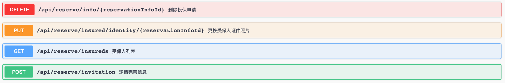
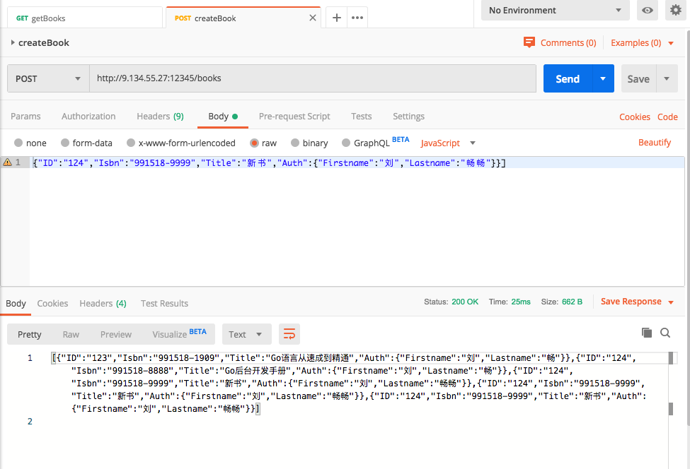

# 二、RESTFul接口实现

## 认识 RESTful 接口

restful 是几年前刮起的 API 设计风潮，在 restful 中使用了 http 标准库还没有支持的一些语义。如下是几个典型的RESTful风格的接口：




REST只是一种风格，而并没有严格意义上的标准，想进一步了解RESTful接口的同学，可以查看知乎上的相关讨论。[https://www.zhihu.com/topic/19579308/hot](https://www.zhihu.com/topic/19579308/hot)


虽然 `net/http` 提供的各种功能已经满足基本需求了，但是很多时候还不够方便，比如：

* 不支持 URL 匹配，所有的路径必须完全匹配，**不能捕获 URL 中的变量**，不够灵活
* 不支持 **HTTP 方法匹配**
* 不支持扩展和嵌套，**URL 处理都在都一个 `ServeMux` 变量中**

虽然这些都可以自己手动去码，但实在很不方便。这部分看看有哪些三方的包，都提供了哪些额外的功能。

## 通过 Gorilla Mux 解析 RESTful URL

Gorilla 提供了很多网络有关的组件， Mux 就是其中一个，负责 HTTP 的路由功能。这个组件弥补了上面提到的 `ServeMux` 的一些缺陷，支持的功能有：

* 更多的匹配类型：**HTTP 方法**、query 字段、URL host 等
* 支持正则表达式作为 URL path 的一部分，也**支持变量提取功能**
* **支持子路由，也就是路由的嵌套**，`SubRouter` 可以实现路由信息的传递
* 并且和 `ServeMux` 完全兼容



Mux的Logo像是一只小猴子， 感兴趣的同学可以访问Mux的官网来进一步了解Mux所提供的能力。官网地址：[https://www.gorillatoolkit.org/pkg/mux](https://www.gorillatoolkit.org/pkg/mux)



接下来我们看看一下如何通过Mux实现简单的RESTful接口：

```go
package main

import (
	"net/http"
	"github.com/gorilla/mux" // 注意 ：这里需要先import mux
)

// Get all books
func getBooks(w http.ResponseWriter, r *http.Request) {
    w.Write([]byte("GET Books"))
}

// Add new book
func createBook(w http.ResponseWriter, r *http.Request) {
	w.Write([]byte("POST Books"))
}

// Get single book
func getBook(w http.ResponseWriter, r *http.Request) {
    params := mux.Vars(r) // 重点2 ： 通过这里拿出url中的参数
    w.Write([]byte("GET Book id = " + params["id"]))
}


// Main function
func main() {
	// Init router
	r := mux.NewRouter()

	// Route handles & endpoints
	r.HandleFunc("/books", getBooks).Methods("GET")  // 重点1 ： 设置HTTP方法和路由路径
	r.HandleFunc("/books/{id}", getBook).Methods("GET")
	r.HandleFunc("/books", createBook).Methods("POST")

	// Start server
	http.ListenAndServe(":12345", r)
}
```

#### 重点1 ： 设置HTTP方法和路由路径

上述代码中可以看出， mux 通过 Method 方法， 增加了对"/books" 等路由对应的具体HTTP方法

```go
r.HandleFunc("/books", getBooks).Methods("GET")  
```

#### 重点2 ： 通过这里拿出url中的参数

```go
// Get single book
func getBook(w http.ResponseWriter, r *http.Request) {
    params := mux.Vars(r) // 重点2 ： 通过这里拿出url中的参数
    w.Write([]byte("GET Book id = " + params["id"]))
}
...

r.HandleFunc("/books/{id}", getBook).Methods("GET")
...

```

mux 中通过"/url/{params}"这种形式，可以匹配URL中对对应的参数。在handle中通过 `params := mux.Vars(r)` 可以将其取出。

## 使用 JSON 传递数据

Golang 的 `encoding/json` 库已经提供了很好的封装，可以让我们很方便地进行 JSON 数据的转换。

| Go类型 | JSON类型 | 注意 |
| :--- | :--- | :--- |
| Bool | JSON booleans |  |
| 浮点数、整数 | JSON numbers |  |
| 字符串 String | JSONG String | 字符串会转换成 UTF-8 进行输出 无法转换的会打印对应的 unicode 值。 |
| 数组 slice | JSON arrays | \[\]byte 会被转换为 base64 字符串 nil slice 会被转换为 JSON null |
| struct | JSON objects | 只有导出的字段（以大写字母开头）才会在输出中 |


struct中的成员首字母为小写时，为private字段，不会转换。


下面我们通过一个具体的例子来实现一个Struct与JSON字串间的转换：

```go
package main

import (
	"net/http"
    "github.com/gorilla/mux"
    "encoding/json"
)

type Book struct {
    ID string
    Isbn string
    Title string
    Auth *Author
}
type Author struct {
	Firstname string 
	Lastname  string 
}
var books []Book

func getBooks(w http.ResponseWriter, r *http.Request) {
    json.NewEncoder(w).Encode(books)
}

func createBook(w http.ResponseWriter, r *http.Request) {

    // 先将JSON decode到对应的结构体中
	var book Book
	json.NewDecoder(r.Body).Decode(&book)
	books = append(books, book)
	
	// 再输出出来
	json.NewEncoder(w).Encode(books)
}

func main() {

    books = append(books, Book{ID:"123", Isbn:"991518-1909", Title:"Go语言从速成到精通", Auth: &Author{"刘","畅"}})
    books = append(books, Book{ID:"124", Isbn:"991518-8888", Title:"Go后台开发手册", Auth: &Author{"刘","畅"}})

	r := mux.NewRouter()
	r.HandleFunc("/books", getBooks).Methods("GET")  
	r.HandleFunc("/books", createBook).Methods("POST")

	http.ListenAndServe(":12345", r)
}
```

## 使用 Postman 调试所实现的RESTful接口

借助浏览器，我们可以比较方便的调试GET方法的接口， 然后遇到POST、UPDATE等类型的接口时，我们往往会通过Postman这样的工具来调试。

postman的官网和下载地址是：[https://www.getpostman.com](https://www.getpostman.com)



以上是Postman中调试上述createBook所展示的界面

在Postman中也可以将已经写好的请求导出成文档， 并导入到其他人的Postman中。我将上述两个接口导出了一下，大家可以自行实验，地址如下： [https://documenter.getpostman.com/view/7248337/SVtZuRUv?version=latest](https://documenter.getpostman.com/view/7248337/SVtZuRUv?version=latest)

## 小结

这一小结中，我们通过mux库编写了基于RESTful服务。这里mux为我们提供了HTTP方法以及URL变量的提取能力。之后通过encoding/json我们了解到了如何将struct和json互相转换。并最后通过postman这样的工具完成了一个POST API 的调用。

下一节我们开始使用gRPC来实现接口的调用， 这种方法相对于RESTFul拥有更高的传输效率。

