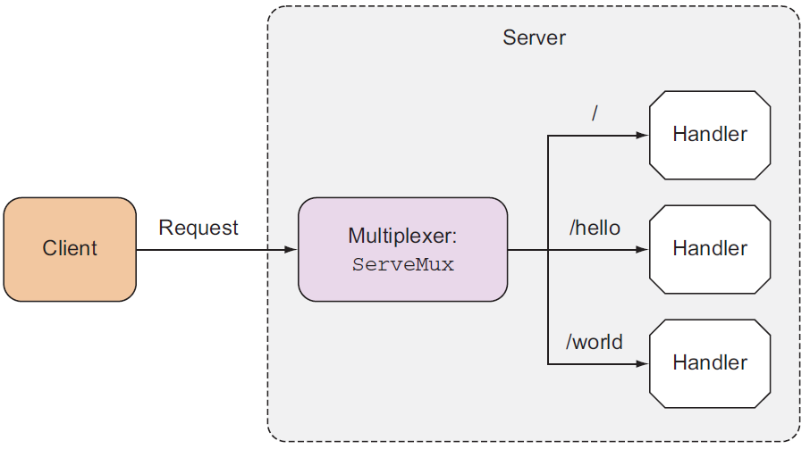

# 一、简单的HTTP服务的实现

## 利用net/http搭建一个简单的HTTP服务器

golang的标准库net/http提供了http编程相关的接口。net/http主要封装了路由、以及对协议的封包和解包细节。用户只需要和 http.request 和 http.ResponseWriter 两个对象交互即可。下面我们开始编写这个简单的hello wold程序。

### 基本方法


没有服务器的同学，你可以暂时用你的开发机代替，或参考Q&A中的“自研云服务器申请” 申请一台自己的自研云服务器吧。


在服务器的shell中键入如下命令， 先创建一个空的目录，并在此目录下创建一个hello\_server.go源文件。

```bash
$ mkdir HelloWorld && cd HelloWorld # 创建并进入HelloWorld文件夹
$ touch hello_server.go # 创建一个新的go源文件
```

之后我们在 hello\_server.go 文件中填写如下代码，其中有两个我们需要重点分析的地方， 我这里用注释先标记出来：

```go
package main

import (
    "net/http"
)

type helloHandler struct{}

func (h *helloHandler) ServeHTTP(w http.ResponseWriter, r *http.Request) {
    w.Write([]byte("Hello, world!")) // 重点2： Handler 接口的实现
}

func main() {
    http.Handle("/", &helloHandler{}) // 重点1： http.Handle 方法的调用
    http.ListenAndServe(":12345", nil)
}
```

#### 重点1： http.Handler 方法调用

先来看一下重点1 httpHandler。 `http.Handle(pattern string, handler Handler)` 接收两个参数，一个是路由匹配的字符串，另外一个是 `Handler` 类型的值。其原型如下：

```go
func Handle(pattern string, handler Handler) { 
    ....
}
```

字符串类型的 patten可以简单理解成匹配的URL路径， 而Handler其实他是一个接口，其包含一个ServeHttp\(\)的方法。具体定义如下：

```go
type Handler interface {
    ServeHTTP(ResponseWriter, *Request)
}
```

因此，只要实现Handler接口，并为对应的 ServeHttp\(\) 这个方法提供具体实现， 我们就可以响应一条HTTP请求。


除了net/http之外， go语言也不乏像mux这样优秀的http库。具体的库的性能和特点可以参考这篇文章： [https://colobu.com/2016/03/23/Go-HTTP-request-router-and-web-framework-benchmark/](https://colobu.com/2016/03/23/Go-HTTP-request-router-and-web-framework-benchmark/)


#### 重点2： Handler 接口的实现

接下来具体看一下如何实现Handler接口中的ServeHTTP方法。

```go
type helloHandler struct{}

func (h *helloHandler) ServeHTTP(w http.ResponseWriter, r *http.Request) {
    w.Write([]byte("Hello, world!")) // 重点2： Handler 接口的实现
}
```

和以往面向对象语言的语法有些诧异， go语言中的接口需要借助receiver来实现。因此上述两句先是定义了一个结构体， 再为这个结构体定义了一个receiver，用于实现Handler接口。

如果用面向对象的语言和思想翻译一下上述两句的话：type helloHandler struct{} 可以简单的视为，go语言中定义了一个class， 随后的 func （h \*helloHandler）ServeHTTP\(\){}则是这个class的成员方法。

### 更为简单的方法

#### http.HandleFunc 方式

除了http.Handle之外， go语言还提供http.HandleFunc这一函数，其支持一个普通函数作为Http的响应回调。两者使用的对比如下：

```go
package main

import (
    "net/http"
)

type helloHandler struct{}

func (h *helloHandler) ServeHTTP(w http.ResponseWriter, r *http.Request) { // 形式1 http.Handle
    w.Write([]byte("Hello, world!")) 
}


func hello (w http.ResponseWriter, r *http.Request) { // 形式2 http.HandleFunc
    w.Write([]byte("Hello, world!")) 
}

func main() {
    http.Handle("/", &helloHandler{}) 
    http.HandleFunc("/hello", hello);
    http.ListenAndServe(":12345", nil)
}
```

### 路由：Mux 与 router


在常见的 web 框架中，router 是必备的组件。golang 圈子里 router 也时常被称为 http 的 multiplexer。http 标准库中内置的 mux 来完成简单的路由功能。


虽然上面的代码已经工作，并且能实现很多功能，但是实际开发中，HTTP 接口会有许多的 URL 和对应的 Handler。这里就要讲 `net/http` 的另外一个重要的概念：`ServeMux`。`Mux` 是 `multiplexor` 的缩写，就是多路传输的意思（请求传过来，根据某种判断，分流到后端多个不同的地方）。`ServeMux` 可以注册多了 URL 和 handler 的对应关系，并自动把请求转发到对应的 handler 进行处理。我们还是来看例子吧：

```go
package main

import (
    "io"
    "net/http"
)

func helloHandler(w http.ResponseWriter, r *http.Request) {
    io.WriteString(w, "Hello, world!\n")
}

func echoHandler(w http.ResponseWriter, r *http.Request) {
    io.WriteString(w, r.URL.Path)
}

func main() {
    mux := http.NewServeMux()
    mux.HandleFunc("/hello", helloHandler)
    mux.HandleFunc("/", echoHandler)

    http.ListenAndServe(":12345", mux)
}
```

HttpServer、Mux 和 handler之间的关系，可以用下面这张图简单的描述出来：



## 小结

回顾一下，这一节中通过编写一个简单的http服务， 我们了解到了在go语言中实现http服务的基本方法和概念：1. 如何实现一个Handler接口，2. 如何用HandlerFunc简化Handler的实现，3. Mux的相关概念。

下一节中，我们会了解如何用在go语言中如何实现更为复杂的RESTFul接口。

